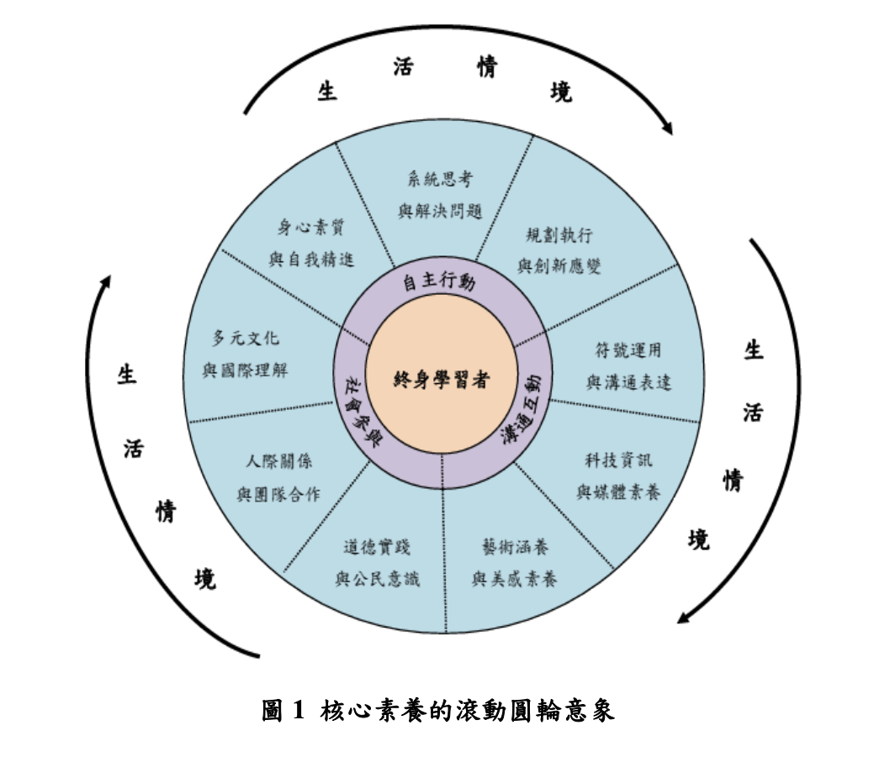

> [!Important]
> - 原檔案：十二年國民基本教育課程綱要 - 總綱
> - 原作者：中華民國教育部
> - 中華民國 103 年 11 月
> - 版權：依據《著作權法》第九條，憲法、法律、命令或公文不得作為著作權之標的，故本文件不受著作權法保護，任何人均可自由使用、重製、散布或改作，無須經過著作權人之同意。

# 壹、修訂背景

我國自民國 18 年訂定國家課程規範，其後歷經數次中小學課程標準修訂，務求課程修訂能與時俱進。自民國 57 年實施九年國民教育以來，以培養健全國民為宗旨，為我國人才培育奠定良好基礎。然而如何紓解過度的升學壓力、落實五育均衡的教育，仍是各界關心的議題。此外，近年來家庭日趨少子女化、人口結構漸趨高齡化、族群互動日益多元、網路及資訊發展快速、新興工作不斷增加、民主參與更趨蓬勃、社會正義的意識覺醒、生態永續發展益受重視，加上全球化與國際化所帶來的轉變，使得學校教育面臨諸多挑戰，必須因應社會需求與時代潮流而與時俱進。

民國 88 年公布的〈教育基本法〉第 11 條明訂：「國民基本教育應視社會發展需要延長其年限。」民國 92 年 9 月召開「全國教育發展會議」，達成「階段性推動十二年國民基本教育」之結論，希望延長國民基本教育年限，將高中、高職及五專前三年予以納入並加以統整，藉以提升國民素質與國家實力。民國 93 年 6 月教育部將「建置中小學課程體系」納入施政主軸，並於民國 95 年成立專案辦公室，完成 12 項子計畫、22 個方案，其中包括「中小學一貫課程體系參考指引」，以引導中小學各級課程綱要之修正。民國 96 年起，教育部亦開始推動特殊教育課程大綱的修訂工作，朝向與中小學普通教育課程接軌的方式規劃，並自民國 100 年起試用。

民國 99 年「第八次全國教育會議」結論指出，應參酌世界先進國家國民教育發展經驗，考量「普及」、「非強迫」、「確保品質」及「社會公義」等原則，積極啟動十二年國民基本教育，以期符合世界教育發展潮流。民國 100 年總統於元旦祝詞宣示啟動十二年國民基本教育，同年 9 月行政院正式核定「十二年國民基本教育實施計畫」，明訂民國 103 年8 月 1 日全面實施。

本次課程綱要在前述背景下，由國家教育研究院、教育部技術及職業教育司進行課程研發，國家教育研究院「十二年國民基本教育課程研究發展會」負責課程研議，教育部「十二年國民基本教育課程審議會」負責課程審議。此次研修係就現行課程實施成效進行檢視，並本於憲法所定的教育宗旨，盱衡社會變遷、全球化趨勢，以及未來人才培育需求，持續強化中小學課程之連貫與統整，實踐素養導向之課程與教學，以期落實適性揚才之教育，培養具有終身學習力、社會關懷心及國際視野的現代優質國民。

# 貳、基本理念

十二年國民基本教育之課程發展本於全人教育的精神，以「自發」、「互動」及「共好」為理念，強調學生是自發主動的學習者，學校教育應善誘學生的學習動機與熱情，引導學生妥善開展與自我、與他人、與社會、與自然的各種互動能力，協助學生應用及實踐所學、體驗生命意義，願意致力社會、自然與文化的永續發展，共同謀求彼此的互惠與共好。

依此，本課程綱要以「成就每一個孩子—適性揚才、終身學習」為願景，兼顧個別特殊需求、尊重多元文化與族群差異、關懷弱勢群體，以開展生命主體為起點，透過適性教育，激發學生生命的喜悅與生活的自信，提升學生學習的渴望與創新的勇氣，善盡國民責任並展現共生智慧，成為具有社會適應力與應變力的終身學習者，期使個體與群體的生活和生命更為美好。

# 參、課程目標

在前述基本理念引導下，訂定如下四項總體課程目標，以協助學生學習與發展。

## 一、啟發生命潛能

啟迪學習的動機，培養好奇心、探索力、思考力、判斷力與行動力，願意以積極的態度、持續的動力進行探索與學習；從而體驗學習的喜悅，增益自我價值感。進而激發更多生命的潛能，達到健康且均衡的全人開展。

## 二、陶養生活知能

培養基本知能，在生活中能融會各領域所學，統整運用、手腦並用地解決問題；並能適切溝通與表達，重視人際包容、團隊合作、社會互動，以適應社會生活。進而勇於創新，展現科技應用與生活美學的涵養。

## 三、促進生涯發展

導引適性發展、盡展所長，且學會如何學習，陶冶終身學習的意願與能力，激發持續學習、創新進取的活力，奠定學術研究或專業技術的基礎；並建立「尊嚴勞動」的觀念，淬鍊出面對生涯挑戰與國際競合的勇氣與知能，以適應社會變遷與世界潮流，且願意嘗試引導變遷潮流。

## 四、涵育公民責任

厚植民主素養、法治觀念、人權理念、道德勇氣、社區/部落意識、國家認同與國際理解，並學會自我負責。進而尊重多元文化與族群差異，追求社會正義；並深化地球公民愛護自然、珍愛生命、惜取資源的關懷心與行動力，積極致力於生態永續、文化發展等生生不息的共好理想。

---

以上課程目標應結合核心素養加以發展，並考量各學習階段特性予以達成，期落實十
二年國民基本教育「自發」、「互動」與「共好」的課程理念，以臻全人教育之理想

# 肆、核心素養

## 一、涵義

為落實十二年國民基本教育課程的理念與目標，茲以「核心素養」做為課程發展之主軸，以裨益各教育階段間的連貫以及各領域/科目間的統整。核心素養主要應用於國民小學、國民中學及高級中等學校的一般領域/科目，至於技術型、綜合型、單科型高級中等學校則依其專業特性及群科特性進行發展，核心素養可整合或彈性納入。

「核心素養」是指一個人為適應現在生活及面對未來挑戰，所應具備的知識、能力與態度。「核心素養」強調學習不宜以學科知識及技能為限，而應關注學習與生活的結合，透過實踐力行而彰顯學習者的全人發展。

## 二、三大面向與九大項目

十二年國民基本教育之核心素養，強調培養以人為本的「終身學習者」，分為三大面向：「自主行動」、「溝通互動」、「社會參與」。三大面向再細分為九大項目：「身心素質與自我精進」、「系統思考與解決問題」、「規劃執行與創新應變」、「符號運用與溝通表達」、「科技資訊與媒體素養」、「藝術涵養與美感素養」、「道德實踐與公民意識」、「人際關係與團隊合作」、「多元文化與國際理解」。核心素養的內涵，如圖 1 所示。

### （一）自主行動

強調個人為學習的主體，學習者應能選擇適當學習方式，進行系統思考以解決問題，並具備創造力與行動力。學習者在社會情境中，能自我管理，並採取適切行動，提升身心素質，裨益自我精進。

### （二）溝通互動

強調學習者應能廣泛運用各種工具，有效與他人及環境互動。這些工具包括物質工具和社會文化工具，前者如人造物（教具、學習工具、文具、玩具、載具等）、科技（含輔助科技）與資訊等，後者如語言（口語、手語）、文字及數學符號等。工具不是被動的媒介，而是人我與環境間正向互動的管道。此外，藝術也是重要的溝通工具，國民應具備藝術涵養與生活美感，並善用這些工具。

### （三）社會參與

強調學習者在彼此緊密連結的地球村中，需要學習處理社會的多元性，以參與行動與他人建立適切的合作模式與人際關係。每個人都需要以參與方式培養與他人或群體互動的素養，以提升人類整體生活品質。社會參與既是一種社會素養，也是一種公民意識。

## 三、各教育階段核心素養具體內涵

依學生個體身心發展狀況，各階段教育訂有不同核心素養之具體內涵。以下分國民小學教育、國民中學教育及高級中等學校教育等三階段說明，期培養學生在「自主行動」、「溝通互動」與「社會參與」等三大面向上循序漸進，成為均衡發展的現代國民，如表 1 所示。

| 核心素養面向 | 核心素養項目 | 項目說明 | 國民小學教育 | 國民中學教育 | 高級中等學校教育 |
|--------------|-------------|----------|--------------|--------------|----------------|
| A 自主行動  | A1 心素質與我精進 | 具備身心健康發展的素質，擁有合宜的人性觀與自我觀，同時透過選擇，分析處理創新知， 有效規劃生活發展，探索生命意義，並不斷自我精進，追求生活品質。 | E-A1 具備良好的身心健康發展素質，並現身為健康生活習慣，促進身心健康發展，並認識個人價值。 | J-A1 具備良好的身心健康發展知能與能量，並展現自我覺察，探索人性與自我價值，積極實踐。 | U-A1 提升各項身心健康發展素質，探索個人潛能，發展自我觀察，肯定自我價值，並有效規劃生涯，並透過自我精進超越，追求至善與幸福人生。 |
|              | A2 統思考與解問題 | 具備問題處理能力，思辨分析、推理批判的系統思考與概念思考，並能有效處理問題與反思，以有效處理及解決生活生命問題。 | E-A2 具備探索情境問題及思考分析的基本能力，並理理解問題的要素與生活常見問題。 | J-A2 具備問題處理及分析的能力，並能協調不同問題的對應及解決方式。 | U-A2 具備統思考與分析及處理的能力，並能有效連結不同領域的知識，運用不同思維策略處理生活及各種問題。 |
|              | A3 規劃執行與創新應變 | 具備規劃及執行計畫的能力，並試探探索發展多元專業知識，充實生活素養，探索創新精神， 以因應生活變遷，增進個人的彈性適應力。 | E-A3 具備設定計畫目標的基本能力，並有效思考思維方式，及因應生活情境。 | J-A3 具備善用資源與規劃所設定目標的能力，並具有創新思維及應對日常生活情境。 | U-A3 具備規劃執行行動計劃及創新反省的能力，並有效運用問題解決所需的方式作為日常情境或問題。 |
| B 溝通互動  | B1 符號運用與表達 | 具備運用語言、文字、數據、圖表、脈絡等各類符號系統進行有效理解及表達的能力，並能理解邏輯關係及常生活與工作表達。 | E-B1 具備「聽、說、讀、寫、作」的基本能力，並具生活經驗及理解相關。 | J-B1 具備運用各類符號體系表達意圖的能力，並具生活經驗。 | U-B1 具備運用各類符號系統理解及表達的能力，並具理解語言結構並表達意圖。 |
|              | B2 科技資訊與媒體素養 | 具備善用科技、資訊與各類媒體之能力，培養相同倫理及媒體識讀的素養，並分析各類媒體之關係。 | E-B2 具備科技與媒體應用的基本素養，並理解各類媒體內容的意義與影響。 | J-B2 具備科技應用並理解其發展過程，並能運用以分析及作出選擇。 | U-B2 具備適當運用科技並理解媒體之價值，並具反思能力。 |
|              | B3 藝術涵養與美感素養 | 具備藝術素養，創作與鑑賞能力，體會生活學習的省思，豐富美感體驗，並提升個人修養。 | E-B3 具備藝術創作的基本素養，並豐富多元文化的發展，提升生活中的美感感官。 | J-B3 具備藝術創作素養，並具有美感知識，透過欣賞美的事物來提升修養。 | U-B3 具備藝術創作素養及能表現之情感，並具文化理解及交流。 |
| C 社會參與  | C1 道德實踐與公民意識 | 具備道德實踐的素養，從個人小我到社會公民，循序漸進，養成社會責任感及公共意識，並積極參與與社會活動，關鍵並樂善與善的品德。 | E-C1 具備個人道德與知識的素養，並非斷定的能力，守理道德的行範。 | J-C1 培養道德意識，並進行公民與公共環境關聯，並展現自我覺察，探索人性與自我價值。 | U-C1 具備對道德問題的思考與分析能力，並具良好道德觀、理解社會責任，並為社會與個人貢獻。 |
|              | C2 人際關係與團隊合作 | 具備良好的國際情感及與他人建立良好的互動關係，並發展良好的溝通協調，並發展具合作團隊精神。 | E-C2 具備理解與他人感受、樂於協助與合作之素養，並具應對各種人際合作的能力。 | J-C2 具備利他與合作群體的知能，並能解釋其行為，並善於與他人合作。 | U-C2 具備適切的溝通合作與人際情感的素養，並具更強的合作能力，促進整體合作之工作。 |
|              | C3 多元文化與國際解 | 具備我文化及認同的信念，並尊重與欣賞多元文化，積極關注全球議題及國際趨勢，且能順應時代展現與社會需求，發展國際理論，多元文化價值觀與世界和平的胸懷。 | E-C3 具備理解與接觸多元文化的素養，關心本土與國際事務，並尊重與欣賞文化的多元性。 | J-C3 具備敏感與接納多元文化的素養，關心本土與國際事務，並尊重與欣賞差異。 | U-C3 在接受自我文化價值的同時，亦能尊重其他文化，具備國際化眼光並具備國際合作力。 |

表 1 各教育階段核心素養內涵

> [!NOTE]
> 上表中，A、B、C 代表核心素養「自主行動」、「溝通互動」與「社會參與」等三大面向。國民小學、國民中學、高級中等學校所對應之教育階段的各項核心素養，依各階段的教育特質加以衍生，並加上階段別之編碼；其中 E 代表國民小學教育階段、J 代表國民中學教育階段、U 代表高級中等學校教育階段。

表述的核心素養，將透過各學習階段、各課程類型的規劃，並結合領域綱要的研修，以落實於課程、教學與評量中。各領域/科目的課程綱要研修需參照教育部審議通過的「十二年國民基本教育課程發展指引」，考量領域/科目的理念與目標，結合或呼應核心素養具體內涵，以發展及訂定「各領域/科目之核心素養」及「各領域/科目學習重點」。

# 伍、學習階段

十二年國民基本教育依學制劃分為三個教育階段，分別為國民小學教育六年、國民中學教育三年、高級中等學校教育三年。再依各教育階段學生之身心發展狀況，區分如下五個學習階段：國民小學一、二年級為第一學習階段，國民小學三、四年級為第二學習階段，國民小學五、六年級為第三學習階段，國民中學七、八、九年級為第四學習階段，高級中等學校十、十一、十二年級為第五學習階段。

各級各類學校之領域/群科/學程/科目課程，應配合各學習階段的重點，規劃連貫且統整的課程內容，並以「啟發生命潛能」、「陶養生活知能」、「促進生涯發展」及「涵育公民責任」的總體目標為課程規劃的依歸。各學習階段重點分述如下：

## 一、國民小學

1. 第一學習階段係學生學習能力的奠基期，應著重生活習慣與品德的培養，協助學生在生活與實作中主動學習，並奠定語言與符號運用的基礎。
1. 第二學習階段持續充實學生學習能力，發展基本生活知能與社會能力，開發多元智能，培養多方興趣，協助學生能夠透過體驗與實踐，適切處理生活問題。
1. 第三學習階段應協助學生深化學習，鼓勵自我探索，提高自信心，增進判斷是非的能力，培養社區/部落與國家意識，養成民主與法治觀念，展現互助與合作精神。

## 二、國民中學

第四學習階段是學生身心發展的快速期，也是自我探索與人際發展的關鍵期，應持續提升所有核心素養，以裨益全人發展。尤其著重協助學生建立合宜的自我觀念、進行性向試探、精進社會生活所需知能，同時鼓勵自主學習、同儕互學與團隊合作，並能理解與關心社區、社會、國家、國際與全球議題。

## 三、高級中等學校

第五學習階段係接續九年國民教育，尤其著重學生的學習銜接、身心發展、生涯定向、生涯準備、獨立自主等，精進所需之核心素養、專門知識或專業實務技能，以期培養五育均衡發展之優質公民。第五學習階段包括四種類型的高級中等學校，其重點如下：

1. 普通型高級中等學校：提供一般科目為主的課程，協助學生試探不同學科的性向，著重培養通識能力、人文關懷及社會參與，奠定學術預備基礎。
1. 技術型高級中等學校：提供一般科目、專業科目及實習科目課程，協助學生培養專業實務技能、陶冶職業道德、增進人文與科技素養、創造思考及適應社會變遷能力，奠定生涯發展基礎，提升務實致用之就業力。
1. 綜合型高級中等學校：提供一般科目及專精科目的課程，協助學生發展學術預備或職業準備的興趣與知能，使學生了解自我、生涯試探，以期適性發展。
1. 單科型高級中等學校：提供特定學科領域為主課程，協助學習性向明顯之學生持續開發潛能，奠定特定學科知能拓展與深化之基礎。

# 陸、課程架構

## 一、課程類型與領域/科目劃分

### （一）課程類型

十二年國民基本教育課程類型區分為二大類：「部定課程」與「校訂課程」，如表 2 所示。

| 教育階段                           | 部定課程               | 校訂課程                                           |
|----------------------------------|----------------------|---------------------------------------------------|
| 國民小學                           | 領域學習課程            | 彈性學習課程                                       |
| 國民中學                           | 領域學習課程            | 彈性學習課程                                       |
| 高級中等學校 • 普通型 • 技術型 • 綜合型 • 單科型 | 一般科目 專業科目 實習科目 | 校訂必修課程 選修課程 團體活動時間 彈性學習時間 |

表 2 各教育階段課程類型

1. 「部定課程」：由國家統一規劃，以養成學生的基本學力，並奠定適性發展的基礎。(1)在國民小學及國民中學為培養學生基本知能與均衡發展的「領域學習課程」。(2)在高級中等學校為部定必修課程，其可包含達成各領域基礎學習的「一般科目」，以及讓學生獲得職業性向發展的「專業科目」及「實習科目」。

2. 「校訂課程」：由學校安排，以形塑學校教育願景及強化學生適性發展。

   1. 在國民小學及國民中學為「彈性學習課程」，包含跨領域統整性主題/專題/議題探究課程，社團活動與技藝課程，特殊需求領域課程，以及本土語文/新住民語文、服務學習、戶外教育、班際或校際交流、自治活動、班級輔導、學生自主學習、領域補救教學等其他類課程。

   2. 在高級中等學校則為「校訂必修課程」、「選修課程」、「團體活動時間」(包括班級活動、社團活動、學生自治活動、學生服務學習活動、週會或講座等)及「彈性學習時間」(包含學生自主學習、選手培訓、充實（增廣）/補強性課程及學校特色活動)。其中，部分選修課程綱要由領域課程綱要研修小組研訂，做為學校課程開設的參據。

## （二）領域/科目劃分

十二年國民基本教育課程依據全人教育之理念，配合知識結構與屬性、社會變遷與知識創新及學習心理之連續發展原則，將學習範疇劃分為八大領域，提供學生基礎、寬廣且關聯的學習內涵，獲得較為統整的學習經驗，以培養具備現代公民所需之核心素養與終身學習的能力。

部分領域依其知識內涵與屬性包含若干科目，惟仍需重視領域學習內涵。國民小學階段，以領域教學為原則；國民中學階段，在領域課程架構下，得依學校實際條件，彈性採取分科或領域教學，並透過適當的課程設計與教學安排，強化領域課程統整與學生學習應用；高級中等學校教育階段，在領域課程架構下，以分科教學為原則，並透過跨領域/科目專題、實作/實驗課程或探索體驗等課程，強化跨領域或跨科的課程統整與應用。

> [!NOTE]
> 由***陸、課程架構***第三項 ***（三）「十二年國民基本教育各教育階段共同課程之領域課程架構」***，至 ***柒、實施要點*** 之前，由於內容過長且有許多表格，故不完整陳列。詳教育部官方檔案。

# 柒、實施要點

實施要點係基於十二年國民基本教育課程之自發、互動與共好理念，對於教師、學校、政府、家長、民間組織等教育夥伴，提出課程綱要實施必要之規範與鼓勵創新活力之建議；其目的係為促成學校教育的公共對話、提供學校課程設計與發展彈性、支持教師教學與學生學習、整合多元教學資源、評估課程實施成果，以保障學生的學習權，並強化教師的專業責任。

本實施要點包括課程發展、教學實施、學習評量與應用、教學資源、教師專業發展、行政支持、家長與民間參與及附則等八大項目。

## 一、課程發展

課程發展要能因應不同教育階段之教育目標與學生身心發展之特色，提供彈性多元的學習課程，以促成學生適性發展，並支持教師課程研發與創新。學校課程計畫是學生學習的藍圖、課程公共對話與溝通的重要文件；透過學校課程發展委員會的組織與運作，持續精進國民教育及學校本位課程發展。

### (一) 學校課程發展委員會組織與運作

1. 學校為推動課程發展應訂定「課程發展委員會組織要點」，經學校校務會議通過後，據以成立學校課程發展委員會。學校課程發展委員會下得設各領域/群科/學程/科目教學研究會。學校得考量學校規模與地理特性，聯合成立校際之課程發展委員會。
2. 學校課程發展委員會之組成及運作方式由學校校務會議決定之，其學校課程發展委員會成員應包括學校行政人員、年級及領域/群科/學程/科目（含特殊需求領域課程）之教師、教師組織代表及學生家長委員會代表，高級中等學校教育階段應再納入專家學者代表，各級學校並得視學校發展需要聘請校外專家學者、社區/部落人士、產業界人士或學生。
3. 學校課程發展委員會應掌握學校教育願景，發展學校本位課程，並負責審議學校課程計畫、審查全年級或全校且全學期使用之自編教材及進行課程評鑑等。
4. 學校課程計畫為學校本位課程規劃之具體成果，應由學校課程發展委員會三分之二以上委員出席，二分之一以上出席委員通過，始得陳報各該主管機關。

### (二) 課程設計與發展

1. 學校課程發展應重視不同領域/群科/學程/科目間的統整，以及各教育階段間之縱向銜接。
2. 課程設計應適切融入性別平等、人權、環境、海洋、品德、生命、法治、科技、資訊、能源、安全、防災、家庭教育、生涯規劃、多元文化、閱讀素養、戶外教育、國際教育、原住民族教育等議題，必要時由學校於校訂課程中進行規劃。
3. 為因應特殊類型教育學生之個別需要，應提供支持性輔助、特殊需求領域課程及實施課程調整。
4. 特殊教育學生的課程必須依據特殊教育法所規範的個別化教育計畫或個別輔導計畫適性設計，必要時得調整部定必修課程，並實施教學。
5. 學校課程計畫至少包含總體架構、彈性學習及校訂課程規劃（含特色課程）、各領域/群科/學程/科目之教學重點、評量方式及進度等。在遵照教學正常化規範下，得彈性調整進行跨領域的統整及協同教學。
6. 學校課程計畫應由學校課程發展委員會通過後，於開學前陳報各該主管機關備查，並運用書面或網站等多元管道向學生與家長說明。為有利於學生選校參考，高級中等學校應於該年度新生入學半年前完成課程計畫備查與公告說明。
7. 中央及地方應建立學校課程計畫發展與實施之輔導與資源整合平台。

### (三) 課程評鑑

1. 各該主管機關應建立並實施十二年國民基本教育課程評鑑機制，以評估課程實施與相關推動措施成效，運用所屬學校及各該主管機關課程評鑑過程與成果資訊，回饋課程綱要之研修，並且作為課程改進之參考；中央主管機關可建置學生學習成就資料庫，評鑑部定課程實施成效。
2. 各該主管機關應整合課程相關評鑑與訪視，並協助落實教學正常化；課程評鑑結果不作評比、不公布排名，而是做為課程政策規劃與整體教學環境改善之重要依據。
3. 學校課程評鑑以協助教師教學與改善學生學習為目標，可結合校外專業資源，鼓勵教師個人反思與社群專業對話，以引導學校課程與教學的變革與創新。學校課程評鑑之實施期程、內容與方式，由各該主管機關訂定之。

### (四) 課程實驗與創新

1. 各該主管機關應提供學校本位課程研發與實施的資源，鼓勵教師進行課程與教材教法的實驗及創新，並分享課程實踐的成果。
2. 各該主管機關宜分析課程研發與實驗成果，以回饋課程綱要之研修。

## 二、教學實施

為實踐自發、互動和共好的理念，教學實施要能轉變傳統以來偏重教師講述、學生被動聽講的單向教學模式，轉而根據核心素養、學習內容、學習表現與學生差異性需求，選用多元且適合的教學模式與策略，以激發學生學習動機，學習與同儕合作並成為主動的學習者。

### (一) 教學準備與支援

1. 教師應於每學期開學前做好教學規劃，並準備教學所需資源及相關事項。
2. 教師備課時應分析學生學習經驗、族群文化特性、教材性質與教學目標，準備符合學生需求的學習內容，並規劃多元適性之教學活動，提供學生學習、觀察、探索、提問、反思、討論、創作與問題解決的機會，以增強學習的理解、連貫和運用。
3. 教師宜配合平日教學，進行創新教學實驗或行動研究，其所需之經費與相關協助，各該主管機關應予支持。

### (二) 教學模式與策略

1. 教師應依據核心素養、教學目標或學生學習表現，選用適合的教學模式，並就不同領域/群科/學程/科目的特性，採用經實踐檢驗有效的教學方法或教學策略，或針對不同性質的學習內容，如事實、概念、原則、技能和態度等，設計有效的教學活動，並適時融入數位學習資源與方法。
2. 為促進本土語文/新住民語文課程之學習，其教學語言應以本土語言/新住民語言的單語為主，雙語為輔，並注重目標語的互動式、溝通式教學，以營造完全沉浸式或部分沉浸式教學。其他領域/群科/學程/科目之課程學習，在可結合情境與能理解的前提下，應鼓勵教師使用雙語，以融入各領域教學，結合彈性學習課程及各項活動；日常生活應鼓度學生養成使用雙語或多語的習慣。
3. 為能使學生適性揚才，教師應依據學生多方面的差異，包括年齡、性別、學習程度、學習興趣、多元智能、身心特質、族群文化與社經背景等，規劃適性分組、採用多元教學模式及提供符合不同需求的學習材料與評量方式等，並可安排普通班與特殊類型教育學生班交流之教學活動。
4. 教師指派學生作業宜多元、適性與適量，並讓學生了解作業的意義和表現基準，以提
5. 教師應建立有助於學習的班級規範，營造正向的學習氣氛與班級文化，並加強親師生溝通與合作等，以提升學生學習成效。
6. 教師宜適切規劃戶外教育、產業實習、服務學習等實地情境學習，以引導學生實際體驗、實踐品德、深化省思與提升視野。
7. 為增進學生學習成效，具備自主學習和終身學習能力，教師應引導學生學習如何學習，包括動機策略、一般性學習策略、領域/群科/學程/科目特定的學習策略、思考策略，以及後設認知策略等。

## 三、學習評量與應用

學生是學習的主體，教師的教學應關注學生的學習成效，重視學生是否學會，而非僅以完成進度為目標。為了解學生的學習過程與成效，應使用多元的學習評量方式，並依據學習評量的結果，提供不同需求的學習輔導。

### (一) 學習評量實施

1. 學習評量依據各該主管機關訂定之學習評量準則及相關補充規定辦理。
2. 學習評量應兼顧形成性評量、總結性評量，並可視學生實際需要，實施診斷性評量、安置性評量或學生轉銜評估。
3. 教師應依據學習評量需求自行設計學習評量工具。評量的內容應考量學生身心發展、個別差異、文化差異及核心素養內涵，並兼顧認知、技能、情意等不同層面的學習表現。
4. 為因應特殊類型教育學生之個別需求，學校與教師應提供適當之評量調整措施。
5. 學習評量方式應依學科及活動之性質，採用紙筆測驗、實作評量、檔案評量等多元形式，並應避免偏重紙筆測驗。
6. 學習評量報告應提供量化數據與質性描述，協助學生與家長了解學習情形。質性描述可包括學生學習目標的達成情形、學習的優勢、課內外活動的參與情形、學習動機與態度等。

### (二) 評量結果應用

1. 學習評量係本於證據為基礎之資料蒐集，其結果應妥為運用，除作為教師改進教學及輔導學生學習外，並可作為學校改進課程之參考依據。
2. 教師應依據學習評量結果與分析，診斷學生的學習狀態，據以調整教材教法與教學進度，並提供學習輔導。對於學習落後學生，應調整教材教法與進行補救教學；對於學習快速學生，應提供加速、加深、加廣的學習。

## 四、教學資源

教學資源包括各種形式的教材與圖儀設備，研究機構、社區、產業、民間組織所研發的資源，以及各界人力資源。各該政府應編列經費，鼓勵教師研發多元與適切的教學資源。實施學校課程計畫所需的教學資源，相關教育經費，中央與地方應予支持。

### (一) 教科用書選用

1. 教科用書應依據課程綱要編輯，並依法審定；學校教科用書由學校依相關選用辦法討論通過後定之。
2. 各級各類學校相關課程及教材，應採多元文化觀點，並納入性別平等與各族群歷史文化及價值觀，以增進族群間之了解與尊重。
3. 除審定之教科用書外，直轄市、縣(市)主管機關或學校得因應地區特性、學生特質與需求、領域/群科/學程/科目屬性等，選擇或自行編輯合適的教材。全年級或全校且全學期使用之自編自選教材應送學校課程發展委員會審查。

### (二) 教材研發

1. 教材研發包括教科用書、各類圖書、數位教材、補救教材與診斷工具及各種學習資源等，需衡量不同學習階段間的縱向銜接及領域/群科/學程/科目及課程類型之間的橫向統整。
2. 配合課程綱要實施，教育部應建立資源研發之合作機制，促進研究機構、大學院校、中小學、社區、民間組織、產業等參與教材、教學與評量資源的研發；直轄市、縣（市）主管機關得開發具地方特色之資源，或鼓勵學校自編校本特色教材與學習資源。
3. 各該主管機關與學校可整合校內外人力資源，協力合作以精進課程、研發補救教材與診斷工具等，提升學生學習成效。
4. 中央主管機關應整合建置課程與教學資源平台，以單一入口、分眾管理、品質篩選、共創共享與尊重智慧財產權等原則，連結各種研發的教學資源，提供學生、教師、家長等參考運用。

## 五、教師專業發展

教師是專業工作者，需持續專業發展以支持學生學習。教師專業發展內涵包括學科專業知識、教學實務能力與教育專業態度等。教師應自發組成專業學習社群，共同探究與分享交流教學實務；積極參加校內外進修與研習，不斷與時俱進；充分利用社會資源，精進課程設計、教學策略與學習評量，進而提升學生學習成效。

### (一) 教師專業發展實施內涵

1. 教師可透過領域/群科/學程/科目（含特殊需求領域課程）教學研究會、年級或年段會議，或是自發組成的校內、跨校或跨領域的專業學習社群，進行共同備課、教學觀察與回饋、研發課程與教材、參加工作坊、安排專題講座、實地參訪、線上學習、行動研究、課堂教學研究、公開分享與交流等多元專業發展活動方式，以不斷提升自身專業知能與學生學習成效。
2. 教師應充實多元文化與特殊教育之基本知能，提升對不同文化背景與特殊類型教育學生之教學與輔導能力。
3. 為持續提升教學品質與學生學習成效，形塑同儕共學的教學文化，校長及每位教師每學年應在學校或社群整體規劃下，至少公開授課一次，並進行專業回饋。
4. 原住民族教育師資應修習原住民族文化教育課程，以增進教學專業能力。

### (二) 教師專業發展支持系統

1. 學校對於課程設計、教材研發、教學策略、學習評量與學習輔導等，積極開發並有具體事蹟者，應給予必要之協助與獎勵。
2. 各該主管機關與學校應支持並提供教師專業發展之相關資源，如安排教學研究會或教師專業學習社群的共同時間、支持新進教師與有需求教師的專業發展，提供並協助爭取相關設備與經費等資源。
3. 各該主管機關與學校應鼓勵並支持教師進行跨領域/群科/學程/科目的課程統整、教師間或業師間之協同教學，以及協助教師整合與運用教育系統外部的資源，例如社區、非營利組織、產業、大學院校、研究機構等資源，支持學生多元適性的學習。
4. 教師為了掌握領域課程綱要的內容，以及發展跨領域/科目課程及教學之專業素養，各該主管機關應提供教師研習或進修課程，並協助教師進行領域教學專長認證或換證。
5. 各該主管機關應從寬編列經費預算，協助並支持教師進行專業發展與進修成長。

## 六、行政支持

各該主管機關與學校之行政支持是為了協助學校課程與教學的實施，並支持教師教學與學生學習，以實現課程綱要的理念與目標，行政支持包括經費與專業支持，以及相關配套修訂等。

### (一) 經費與專業支持

1. 為維護學生受教權、健全教育發展及提升經費運用成效，各該主管機關應從寬編列經費預算，支持學校因應教學課程計畫研發與實施之所需。
2. 各該主管機關應針對本課程實施要點，配合檢視修正與增訂相關法令，如師資培育法與設備基準等，並完善配套措施。
3. 課程綱要實施前，各該主管機關應因地制宜辦理多元形式的相關研討，使各該主管機關行政人員、督學、學校行政人員、教師、家長、師資培育機構等充分了解課程綱要之理念目標、內容與實施。課程綱要實施後，學校應秉持學校本位之原則，規劃教師專業發展活動。
4. 各該主管機關得就課程設計、教材編選與教學實施作整體或抽樣調查研究，以了解課程與教學實施狀況，並提供各校改進所需之資源；各校得依據結果，秉持學校本位與教師專業自主積極改進。
5. 各該主管機關應整合現有國民教育輔導群/團、學科中心與群科中心、辦理師資培育之大學、師資培用聯盟等，訂定相關法規，完善十二年國民基本教育輔導機制，強化其參與課程綱要研修、進行課程溝通與傳播推展、規劃辦理各式研習與工作坊等專業任務，以落實推動課程綱要。
6. 各該主管機關應協助學校克服課務運作、課程選修及師資安排等困難；另應依實際需要編列人事、業務相關預算，依領域/群科/學程/科目課程綱要和教育部訂定之設備基準，充實改善圖書館、專科與實習教室、設備與圖書。學校亦得視教學需求，建立各領域/群科/學程/科目之間設備共享機制，以充分發揮教學設備之效益。
7. 各該主管機關規劃教育行政人員及校長進修研習時，應強化課程與教學領導的專業知能。

### (二) 相關配套修訂

1. 師資培育機構宜配合本次課程綱要之修訂，培養領域/群科/學程/科目所需師資，並應參酌師資培育法之相關規定，調整其課程與教學，並積極與研究機構、中小學學校建立夥伴關係，共同研發教材教法。
2. 辦理各教育階段重要入學招生考試或學習成就評量等單位，應配合課程綱要實施調整相關事務。
3. 中央主管機關應建立課程綱要研修及執行單位與負責大學（含技專校院）招生機構之對話與研議機制，共同研議大學（含技專校院）招生與課程綱要之關連配套措施。

## 七、家長與民間參與

1. 課程實施需要爭取家長支持及參與，學校應鼓勵家長會成立家長學習社群或親師共學社群，增進親職教養知能，強化親師之間的協同合作，支持學生有效學習與適性發展。
2. 學校應定期邀請家長參與教師公開授課或其他課程與教學相關活動，引導家長關心班級及學校課程與教學之實踐，並能主動與家長正向的溝通互動，建立親師生共學的學校文化。
3. 身心障礙學生的個別化教育計畫需有學生家長參與訂定。
4. 學校可結合民間組織與產業界的社會資源，並建立夥伴關係，以充實教學活動；技術型高級中學、綜合型高級中學與建教合作班得與業界合辦學徒制，提升務實致用的學習成效。

## 八、附則

1. 十二年國民基本教育課程綱要，自 107 學年度起，依照不同教育階段，逐年實施，並考慮不同教育階段銜接問題，研擬課程配套措施。實施年級及時程由教育部公布之。
2. 各級學校全年授課日數與週數依各級學校學生學年學期假期辦法辦理；但每週上課天數應配合行政院人事行政總處行政機關辦公日數之相關規定辦理。
3. 有關學生在校作息及各項非學習節數之活動，由學校依各該主管機關訂定之高級中等學校及國民中學、國民小學學生在校作息時間相關規定自行安排。
4. 依據特殊教育法、國民體育法、藝術教育法及相關法規，特殊教育學生與體育班、藝術才能班及科學班等特殊類型班級學生之部定及校訂課程均得彈性調整（包含學習節數/學分數配置比例與學習內容），並得於校訂課程開設特殊需求領域課程，惟不應減少學習總節數。特殊教育班課程規劃需經學校特殊教育推行委員會審議通過，並送學校課程發展委員會通過後實施；體育班、科學班及依藝術教育法設立之藝術才能班課程規劃應送學校課程發展委員會審議。特殊類型教育課程綱要或實施規範，參照「十二年國民基本教育課程綱要總綱」，由中央主管機關另行訂定之。
5. 有關高級中等學校進修部、實用技能學程、建教合作班、重點產業專班等學制及班別等實施規範，參照「十二年國民基本教育課程綱要總綱」，由中央主管機關另行訂定之。
6. 國民中學實施技藝教育時，應依相關辦法規定實施，得彈性調整學習總節數，開設技藝課程。
7. 依照國民體育法等相關法令，學校應於各學習階段之彈性學習、團體活動或其他學習時間適切安排體育活動。
8. 依照原住民族基本法及原住民族教育法等相關法令，原住民族地區及原住民重點學校的領域學習課程，可依原住民族學生學習需求及民族語言文化差異進行彈性調整，實施原住民族教育。其中，原住民族語文課程應列為優先。再者，高級中等學校教育階段原住民重點學校應於校訂課程開設 6 學分原住民族語文課程，並得於假日或寒、暑假實施。
9. 實驗教育之課程實施，由各該主管機關及學校依相關法令辦理。
10. 各領域/群科/學程/科目之課程發展與教學實施，參照各領域/群科/學程/科目之課程綱要，並可視相關知識的更新進展而適切調整學習內容。為促成課程的彈性組合，領域課程綱要研修，應訂定領域內科目的修習年級、必修及選修的適性進路等，在總節數不減少下，各領域可在不同年級規劃修習不同科目，以減少每週修習科目。各領域綱要研修應結合各議題，以期讓學生在不同的學習脈絡中思考這些議題，以收相互啟發與統整之效。

